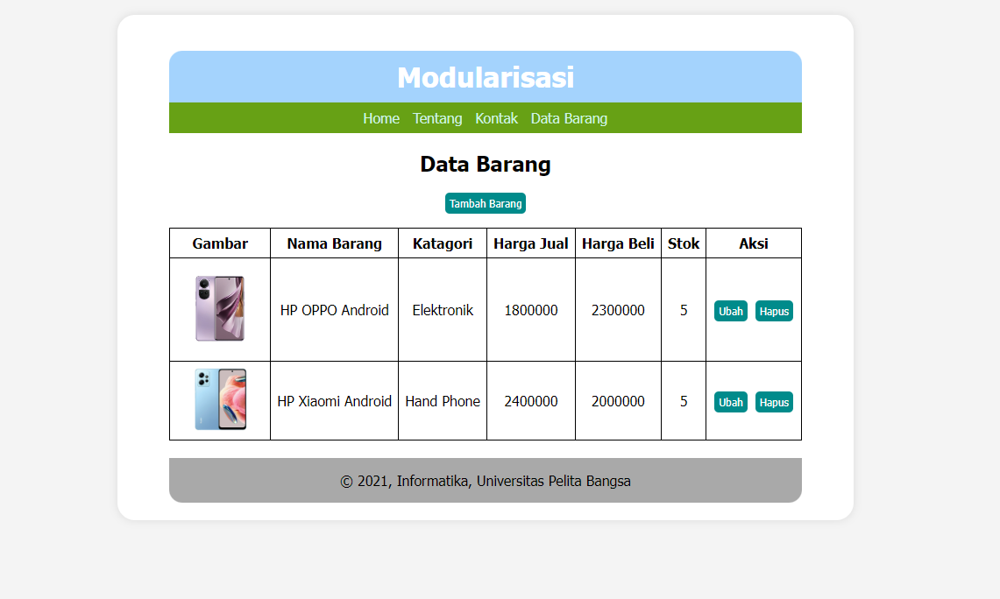
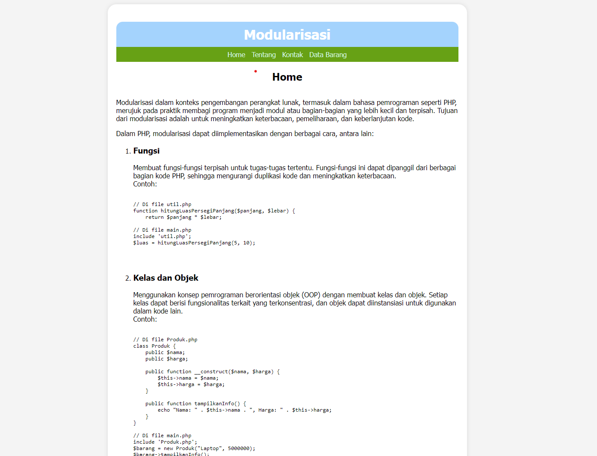
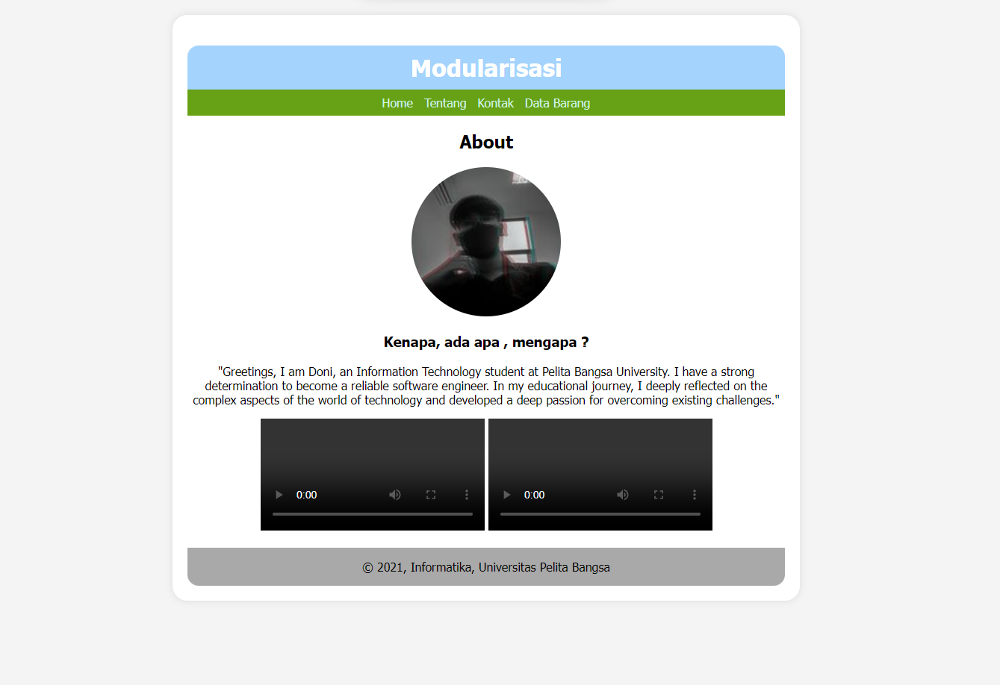
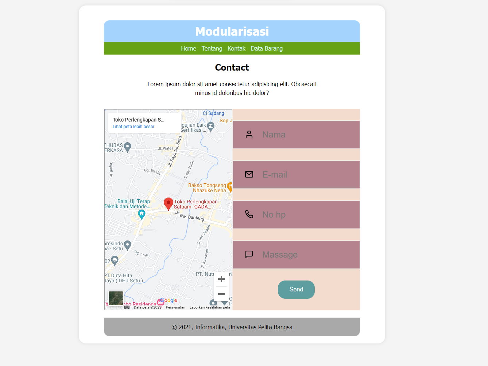
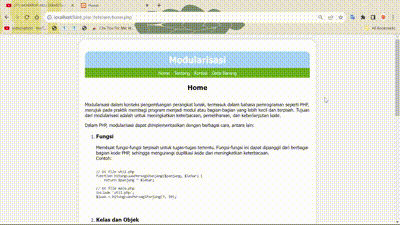

# **Lab 9 PHP Modular**

```
Nama    : Dipca Anugrah
NIM     : 312210666
Kelas   : TI.22.A.4
Matkul  : Pemrograman Web 1
```

## **Daftar Isi**
**[Instruksi Praktikum](#instruksi-praktikum)**         
**[Langkah-langkah Praktikum](#langkah-langkah-praktikum)**         
**[Result](#result)**

## **Instruksi Praktikum**
1. Persiapkan text editor misalnya VSCode.
2. Buat folder baru dengan nama **lab8_php_database** pada docroot webserver 
(htdocs)
3. Ikuti langkah-langkah praktikum yang akan dijelaskan berikutnya.

## **Langkah-langkah Praktikum**
1. **Persiapan**
Untuk memulai membuat aplikasi CRUD sederhana, yang perlu disiapkan adalah 
database server menggunakan MySQL. Pastikan MySQL Server sudah dapat dijalankan 
melalui XAMPP. 

2. **Buat file baru dengan nama header.php**
    ```html
        <h1>Modularisasi</h1>
        <nav>
            <a href="home.php">Home</a>
            <a href="about.php">Tentang</a>
            <a href="kontak.php">Kontak</a>
            <a href="index.php">Data Barang</a>
        </nav>
    ```

    

3. **Buat file baru dengan nama footer.php**
    ```html
        <footer>
            <p>&copy; 2021, Informatika, Universitas Pelita Bangsa</p>
        </footer>
    ```

    

4. **Buat file baru dengan nama home.php**
    ```html 
        <?php require('header.php'); ?>

        <div class="content">
        Modul Praktikum Pemrograman Web
        Agung Nugroho (agung@pelitabangsa.ac.id) 78
        Universitas Pelita Bangsa, Bekasi
            <h2>Ini Halaman Home</h2>
            <p>Ini adalah bagian content dari halaman.</p>
        </div>

        <?php require('footer.php'); ?
    ```

    

5. **Buat file baru dengan nama about.php**
    ```html
        <?php require('header.php'); ?>
        <div class="content">
        <h2>Ini Halaman About</h2>
        <p>Ini adalah bagian content dari halaman.</p>
        </div>
        <?php require('footer.php'); ?>
    ```

    

6. **Buat file baru dengan nama kontak.php**
    ```html
        <?php require('header.php'); ?>
        <div class="content">
        <h2>Ini Halaman Kontak</h2>
        <p>Ini adalah bagian content dari halaman.</p>
        </div>
        <?php require('footer.php'); ?>
    ```

    
 
## **Result**



<hr>

**[Back-->](#lab-9-php-database)**

    